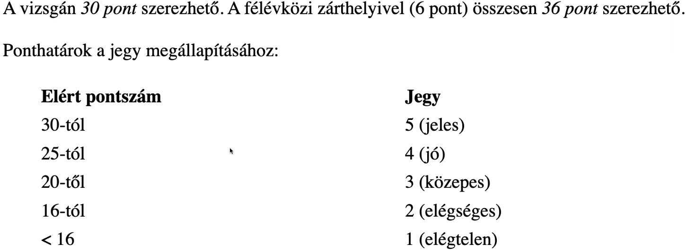

## Bozó István
- bozo_inf@eltte.hu
- Fogadóóra:
  -     H 12-14, P 14-16: 2.518: 8:15 - 9:45
- http://lambda.inf.elte.hu

## Funckprog
- Learn You a Haskell for Great Good (book) https://learnyouahaskell.com/chapters
- legallább 50% vizsgapontot össze kell szedni a vizsgakezdéshez
- 3 gyakorlat mulasztható
- geci egyszerű

## Évfolyam ZH
- félév közepe
- 6 pont
- 1ó:45p
- legalább 1 pontot szerezni kell
## Vizsga


# Haskell basics

```haskell
-- alapfüggvények
isEmpty [] = True
isEmpty [1,2,3] = Exception
isEmpty [x] = False
isEmpty [x,y] = False
isEmpty _ = False
lenght [1..] -- counts to infinite
isEmpty [1..] = False
take 10 [1..] = [1,2,3,4,5,6,7,8,9,10]
product [1..5] = 120
```