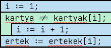

#### Be: 
kartya ∈ S,\
db ∈ N,\
kartyak ∈ S[1..db] = ["7","8","9","t","a","f","k","A"],\
ertekek ∈ N[1..db] = [7,8,9,10,2,3,5,11]

#### Ki: 
ertek ∈ N

#### Ef:
∃ i ∈[1..db]: (kartya = kartyak[i])

#### Uf:
∃ i ∈[1..db]: ((ertek = ertekek[i]) és (kartya = kartyak[i]))

#### Data:
db: 8\
kartya: "t"\
ertek: 10 

